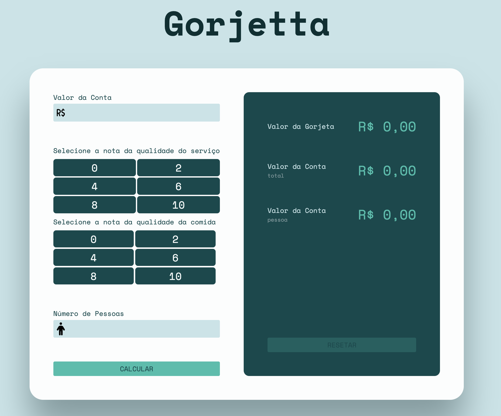

# Gorjetta


- [Gorjetta](#gorjetta)
  - [🧑‍💻 Integrantes](#-integrantes)
  - [⚡️ O Projeto](#️-o-projeto)
  - [🛠️ Backend](#️-backend)
  - [🎯 Funcionalidades](#-funcionalidades)
  - [🖥️ Tecnologias Usadas](#️-tecnologias-usadas)
  - [⚙️ Instale antes de tentar executar o projeto)](#️-instale-antes-de-tentar-executar-o-projeto)
  - [🚀️ Executando os projetos](#️-executando-os-projetos)

<h1 align="center">
   
</h1>

## 🧑‍💻 Integrantes
- [Antonio Victor](https://github.com/Antonio-AV)
- [Ayslan Conti](https://github.com/Aysllan00)
- [Fabio Fiorita](https://github.com/FabioFiorita)
- [Gabriel Cardoso](https://github.com/Gabriel-GCS)

## ⚡️ O Projeto
  Aplicação Web desenvolvido em React para cálculo de gorjetas, por meio da qualidade do serviço e qualidade da comida.

## 🛠️ Backend
  Todo o código desenvolvido para o backend da aplicação está disponível no repositório [Gorjetta-API](https://github.com/FabioFiorita/Gorjetta-API)
## 🎯 Funcionalidades
 - [x] - Cálculo de gorjeta utilizando a lógica fuzzy 
 - [x] - Possibilidade de dividir o valor de acordo com a quantidade das pessoas
 - [x] - Valor da gorjeta levando em conta a porcentagem do estabelecimento
  
## 🖥️ Tecnologias Usadas
 - [ReactJS](https://reactjs.org/)
 - [Python](https://www.python.org/)

## ⚙️ Instale antes de tentar executar o projeto)
 - [Yarn](https://yarnpkg.com/)

## 🚀️ Executando os projetos

1. Clone o repositório: 
```bash
git clone https://github.com/FabioFiorita/Gorjetta && cd Gorjetta
```

2. Instale todas as depencências
```bash
yarn
```

3. Rode o projeto
```bash
yarn start
```

4. Rode o backend seguindo as instruções do repositório [Gorjetta-API](https://github.com/FabioFiorita/Gorjetta-API)